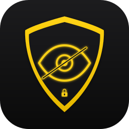

<p align="center">
  
</p>

<h1 align="center">MacShield</h1>

<p align="center">
  <strong>Lock any macOS app with Touch ID, Apple Watch, or password — for free.</strong><br>
  Powerful. Open source. No subscriptions. No compromises.
</p>

<p align="center">
  
  
  <a href="LICENSE"></a>
  <a href="https://github.com/AryanVBW/MacShield/stargazers"></a>
  <a href="https://github.com/AryanVBW/MacShield/releases/latest"></a>
</p>

---

## What is MacShield?

MacShield is a lightweight, native macOS menu bar app that guards your applications behind biometric or proximity authentication. The moment someone tries to open or switch to a protected app, MacShield throws up a full-screen blur overlay and demands Touch ID, Apple Watch confirmation, or a backup password — before a single pixel of private content is revealed.

Unlike sandboxed App Store alternatives, MacShield is distributed directly, giving it the full system access needed to intercept **both launches and activations**, blur across **all monitors**, and forcibly close apps when you walk away.

---

## Why MacShield?

| Feature | MacShield | AppLocker ($17.99) | Cisdem AppCrypt ($19.99/yr) |
|---------|:---------:|:------------------:|:---------------------------:|
| **Price** | **Free forever** | 1 app free, paid for more | Trial only |
| **Open source** | **Yes** | No | No |
| **Touch ID** | **Yes** | Paid only | No |
| **Lock on app switch** | **Yes** | No (launch only) | Yes |
| **Apple Watch unlock** | **Yes** (wrist detection) | No | No |
| **Full-screen overlay** | **Yes** (blur, all monitors) | Yes (solid, single monitor) | Dialog box only |
| **No content flash** | **Yes** (NSPanel) | No (brief flash) | N/A |
| **Auto-close apps** | **Yes** | No (sandbox) | Yes |
| **Close apps on sleep** | **Yes** | No | No |
| **Auto-lock on idle** | **Yes** | No | Yes |
| **Auto-lock on sleep** | **Yes** | No | No |
| **Panic key** | **Yes** | No | No |
| **Multi-monitor** | **Yes** | Unknown | No |
| **Bypass resistant** | **Yes** | No (Bundle ID edit) | Unknown |
| **Chat blur overlay** | **Yes** | No | No |
| **Browser extension** | **Yes** (Chrome) | No | No |

> **Note on App Store alternatives:** AppLocker is sandboxed — it can only intercept launches, not activations. If an app is already running, switching back to it shows content without authentication. MacShield uses a non-activating `NSPanel` overlay that never steals focus, preventing screen freezes and covering both launch and activation events.

---

## Features

### 🔒 App Locking
- Lock any app with **Touch ID** (single prompt, no repeat dialogs)
- **Password fallback** for Macs without Touch ID
- Intercepts both **app launches** and **app switches** — no content flash
- Full-screen **blur overlay** on every connected monitor
- Runs as a **menu bar app** — no Dock icon, completely silent

### ⌚ Apple Watch Unlock
- Proximity-based **auto-unlock** when your Watch is in range and on wrist
- **Wrist detection** via Bluetooth Continuity Nearby Info packets
- Configurable **RSSI threshold** to tune unlock distance
- **Auto-lock** when your Watch leaves range — walk away, Mac locks itself

### 🛡️ Auto-Lock & Auto-Close
- Lock protected apps after a configurable **idle timeout**
- Lock everything when the Mac goes to **sleep**
- **Auto-close** inactive protected apps to prevent notification snooping
- Force-terminate auto-close apps on wake from sleep

### 💬 Chat Blur (Privacy Overlay)
- Blur chat app content with a **live Gaussian blur overlay** (intensity 2–20)
- **Hover-to-reveal** or **click-to-reveal** modes
- Configurable **reveal radius** — only show text near your cursor
- Works alongside app locking or as a standalone privacy layer

### 🌐 Browser Extension
- **Chrome extension** that blurs sensitive web content
- Pairs with MacShield for comprehensive browser privacy

### 🚨 Safety Systems
- **Panic key** — `Cmd+Option+Shift+Control+U` instantly dismisses all overlays
- **System blacklist** — Terminal, Xcode, Activity Monitor, and other critical apps can never be locked
- **Timeout failsafe** — overlays auto-dismiss after 60 seconds without interaction
- **Dev mode** — DEBUG builds include Skip button and 10-second auto-dismiss

### 🔄 Updates & Onboarding
- **Automatic updates** via Sparkle 2 (checks daily)
- **First-launch onboarding** to walk you through setup
- Signed and **notarized** — no Gatekeeper warnings

---

## Installation

### Download (Recommended)

**[⬇ Download Latest Release](https://github.com/AryanVBW/MacShield/releases/latest)**

Open the `.dmg`, drag MacShield to your Applications folder, and launch it. That's it.

> Signed with Developer ID and notarized by Apple — no security warnings.

### Homebrew

```bash
brew tap AryanVBW/tap
brew install --cask macshield
```

### Build from Source

```bash
git clone https://github.com/AryanVBW/MacShield.git
cd MacShield
open MacShield.xcodeproj
```

Press `Cmd+R` to build and run. Requires **Xcode 15+** and **macOS 13+**.

---

## Requirements

- **macOS 13.0 (Ventura)** or later
- **Apple Silicon** or Intel Mac
- **Touch ID** recommended — password fallback is always available
- **Apple Watch** with watchOS 9+ for proximity unlock *(optional)*
- **Xcode 15+** for building from source

---

## How It Works

1. **App Monitor** — watches for protected app launches and activations via `NSWorkspace`
2. **Lock Overlay** — instantly shows a full-screen `NSPanel` blur overlay on all displays before any content is visible
3. **Authentication** — prompts Touch ID, checks Apple Watch proximity, or asks for password
4. **Re-lock on quit** — `Cmd+Q` clears authentication, so the next launch requires re-auth (even for background apps like Messages)
5. **Auto-lock** — re-locks on idle timeout, sleep, or when Apple Watch leaves BLE range
6. **Auto-close** — optionally terminates inactive protected apps to prevent notification snooping
7. **Chat Blur** — a separate Gaussian blur overlay monitors foreground chat apps and blurs their content, revealing only what's near your cursor

---

## Architecture

MacShield is a native Swift/SwiftUI application distributed outside the App Store for full system access.

```
MacShield/
  App/              Entry point, AppDelegate (lifecycle & wiring)
  Core/
    Managers/       ProtectedAppsManager, SafetyManager
    Services/       AppMonitor, Auth, Watch, Overlay, Blur, Idle, Sleep, Inactivity, Updates
    Storage/        Defaults (UserDefaults wrapper), KeychainManager
  UI/
    LockOverlay/    Full-screen blur overlay, password input, Watch toast
    Settings/       Tabbed settings (General, Apps, Security, Blur, Watch, Browser)
    MenuBar/        Menu bar controller & view
    Components/     Design system (buttons, blur view, app icon)
    AppPicker/      Protected app picker
    Onboarding/     First-launch flow
  Models/           AppSettings, ProtectedApp, BlurredApp, AuthMethod, LockSession
  Resources/        Assets, Info.plist, Entitlements
BrowserExtensions/
  Chrome/           Manifest, content script, blur CSS, popup UI
```

**Key frameworks:** SwiftUI, AppKit, LocalAuthentication, CoreBluetooth, IOKit, ServiceManagement, Sparkle 2

---

## Permissions

MacShield requests only what it needs:

| Permission | Why |
|---|---|
| **Accessibility** | Detect app activations (foreground switches) |
| **Bluetooth** | Apple Watch proximity detection via BLE |
| **Screen Recording** | Chat Blur overlay rendering |
| **Notifications** | Unlock confirmation toasts |

MacShield never reads app content, never connects to the internet (except for Sparkle update checks), and never collects telemetry of any kind.

---

## Privacy & Security

- All authentication is handled by **Apple's LocalAuthentication framework** — MacShield never sees your fingerprint or Face data
- Backup passwords are stored in the **macOS Keychain** — never in plain text or UserDefaults
- The app is **fully open source** — every line of code is auditable
- No analytics, no tracking, no external servers

---

## Contributing

Contributions are welcome! Please open an issue before submitting a PR for significant changes.

- **Bug reports:** use the [bug report template](.github/ISSUE_TEMPLATE/bug_report.md)
- **Feature requests:** use the [feature request template](.github/ISSUE_TEMPLATE/feature_request.md)
- **Pull requests:** follow the [PR template](.github/PULL_REQUEST_TEMPLATE.md)

If MacShield is useful to you, a ⭐ star goes a long way — it helps others discover the project.

---

## License

[MIT](LICENSE) — © Vivek W (AryanVBW)

---

<br>

---

## 🙏 Special Thanks & Credits

<p align="center">
  <a href="https://github.com/dutkiewiczmaciej/MakLock">
    
  </a>
</p>

MacShield stands on the shoulders of something exceptional.

**[MakLock](https://github.com/dutkiewiczmaciej/MakLock)** by **[Maciej Dutkiewicz](https://github.com/dutkiewiczmaciej)** is one of those rare open-source projects that makes you stop and think: *"Why didn't this exist before?"* Clean architecture. Thoughtful design. Every edge case considered — the NSPanel overlay that never steals focus, the Apple Watch wrist detection via Continuity packets, the panic key, the safety blacklist. These aren't afterthoughts; they're the product of someone who genuinely cares about getting the details right.

MakLock solved a real problem that paid alternatives had fumbled for years: **true app locking on macOS**, without sandboxing limitations, without subscription paywalls, without compromising on reliability. It's the kind of codebase you read and feel grateful for — because it shows what free, open-source software can be when it's built with craftsmanship.

MacShield is built directly on MakLock's foundation. The core services — app monitoring, authentication, overlay system, Watch proximity, sleep/wake handling, idle detection, safety systems — all originate from MakLock's elegant architecture. MacShield extends this with additional features like the Chat Blur overlay and Chrome extension, but the heart of this project beats because of Maciej's work.

**MakLock is MIT licensed.** Full copyright notice and permission text are preserved in [LICENSE](LICENSE) as required.

> *"If I have seen further, it is by standing on the shoulders of giants."*  
> MacShield exists because MakLock was built with the kind of generosity that makes open source worth believing in.

**⭐ Please go star [MakLock](https://github.com/dutkiewiczmaciej/MakLock) — it deserves every one of them.**

---

<p align="center">
  Made with ❤️ by <a href="https://github.com/AryanVBW">Vivek W (AryanVBW)</a><br>
  Built on the brilliant foundation of <a href="https://github.com/dutkiewiczmaciej/MakLock">MakLock</a> by <a href="https://github.com/dutkiewiczmaciej">Maciej Dutkiewicz</a>
</p>
